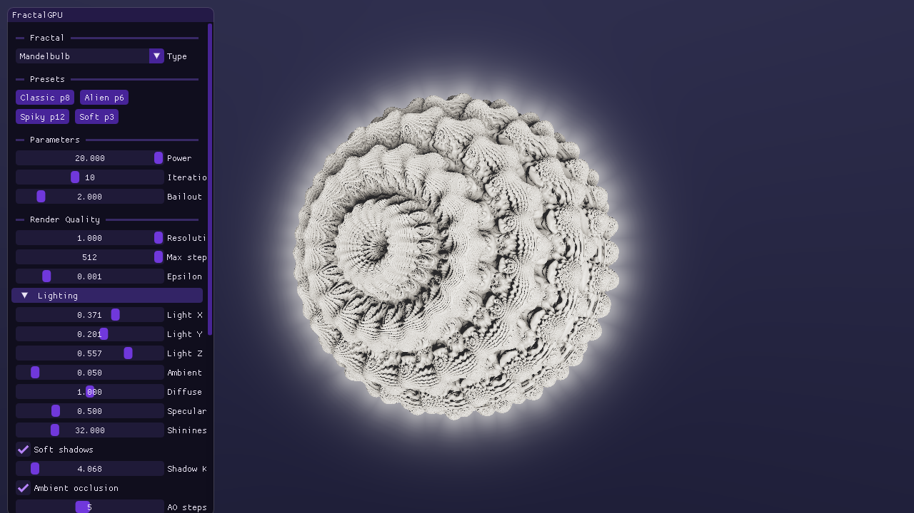
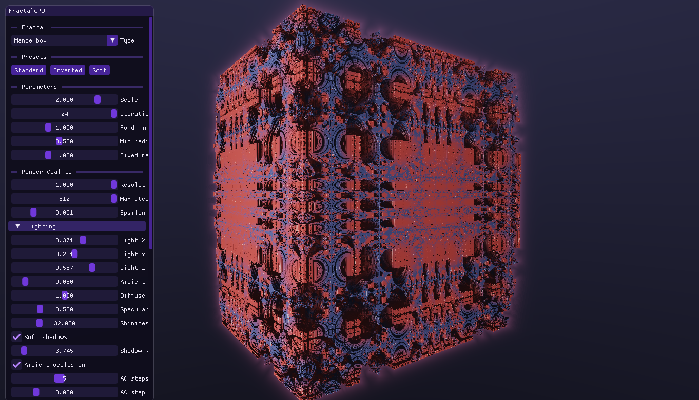
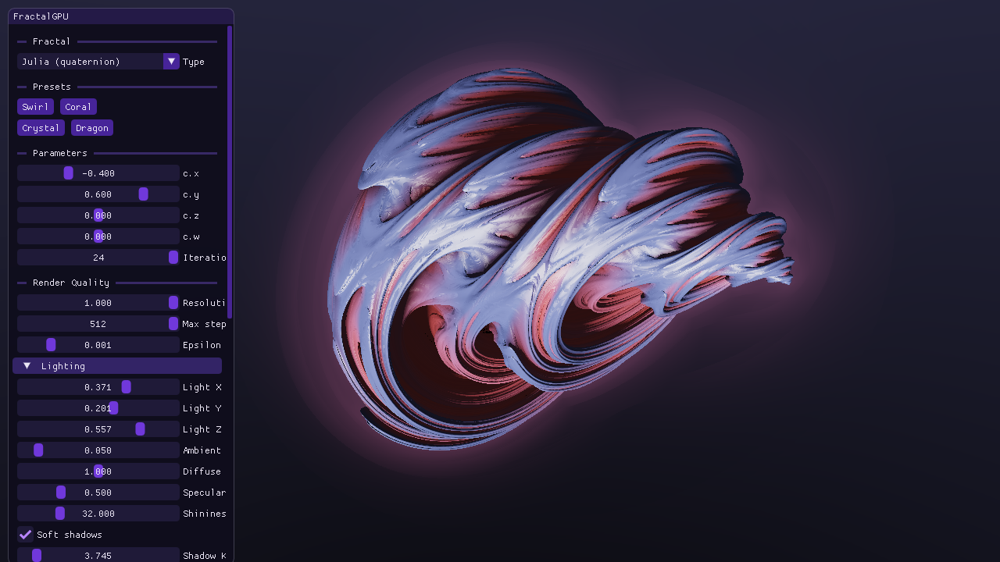

# Fractal GPU

A complex parallelized 3D fractal renderer and engine implemented in C++ and CUDA.

Created by Joshua Hizgiaev and Marcos Traverso

## Building

Run the following to install GLFW3, OpenGL with Mesa (open-source implementation for Linux), and the math library for OpenGL.

```sh
sudo apt instal libgl1-mesa-dev libglu1-mesa-dev libglfw3-dev libglm-dev mesa-utils
```

These libraries will be dynamically linked within CMake besides GLM, which is just headers.

On VSCode it should automatically build, however to build manually:

```sh
cmake -B build
make
./FractalGPU
```

If you want to use ninja generator (reccommended):

```sh
sudo apt install ninja-build
cmake -B build -G Ninja
ninja
./FractalGPU
```

The steps above are for building the *CPU* version of fractalGPU. Proceed forward for CUDA-enabled version.

### Installing CUDA

First make sure your current system contains a CUDA capable GPU before proceeding with the following steps, running the following is a quick check for NVIDIA devices:

```sh
nvidia-smi
```

If an error occurred, you most likely do not have an NVIDIA device.

Moving on, go [download the toolkit for your architecture.](https://developer.nvidia.com/cuda-downloads)

[This guide may also be useful.](https://docs.nvidia.com/cuda/cuda-installation-guide-linux/)

After in

## Results

Our testing results and reports can be found in the `Reports/` folder of this repository.

Below is the initial results from our initial CUDA version:

| Fractal            | CPU (ms/frame) average | GPU (ms/frame) average | Speedup |
| Mandelbulb         | 1315.3                 | 0.4                    | ~3288x  |
| Mandelbox.         | 4669.7                 | 0.9                    | ~5188   |
| Julia (quaternion) | 811.9                  | 0.3                    | ~2706   |

NVIDIA CUDA Profiling Tooling Interface (CUPTI) results and final report on our research and development to be posted soon. This report will include results for volumetric rendering as well.

CUPTI provides branch divergence, throughput, cache, and additional relevent statistics that will show how performant our rendering kernels are. So we believe its extremely important to present them as well. A PDF of our project presentation will also be provided here soon.

### The Algorithm

Here we present our parallel ray-marching algorthim for non-volumetric rendering:

The renderer assigns one CUDA thread per pixel, launching a 2D kernel over the full image with $16\times 16$ thread blocks. Every thread independently traces a ray from the camera through its pixel and produces an HDR RGB value, no thread ever depends on the result of another.

### Ray Generation

Each thread computes a camera ray using a standard model. The forward, right, and up basis vectors are derived from the camera position, target, and up hint. The pixel's NDC coordinates (accounting for aspect ratio and vertical field of view) are used to offset the ray direction away from the camera's forward axis, giving a correct perspective projection.

### Ray Marching

Rather than intersecting geometry analytically, the renderer uses sphere tracing against a Signed Distance Function (SDF). Starting a small epsilon from the ray origin, each step advances the ray by the distance the SDF reports. The core insight being that this distance is always a safe lower bound on how far the ray can travel without overshooting a surface. Iteration continues until:

- The SDF value falls below a hit threshold (`epsilon`), indicating a surface intersection, or the accumulated distance exceeds `maxDist`, indicating a miss.

### Fractals

Three fractal distance estimators are supported that can be selected at runtime:

- **Mandelbulb**: spherical-coordinate power iteration with a derivative-tracked escape distance
- **Mandelbox**: repeated box and sphere folding with a scale-accumulating derivative
- **Julia quaternion set**: 4D quaternion squaring with a running derivative magnitude

### The Host

After the kernel completes, CUDA events capture GPU-side elapsed milliseconds. The float pixel buffer is copied back to host memory and handed off to the existing OpenGL code, keeping the GPU renderer a drop-in replacement for the CPU. How switching works is on compilation, where we use conditional compilation (basically macros) to switch out CPU rendering with GPU rendering. This is done for simplicity purposes.

## CPU Results

Here are the results of our CPU ray-marcher, real-time statistics and performance will be provided in a comprehensive report once CUDA and statistics gather functionality are fully implemented.

### Mandelbulb Render



### Mandelbox Render



### Julia Set Quaternion Render


